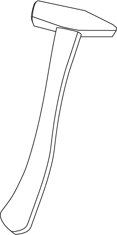
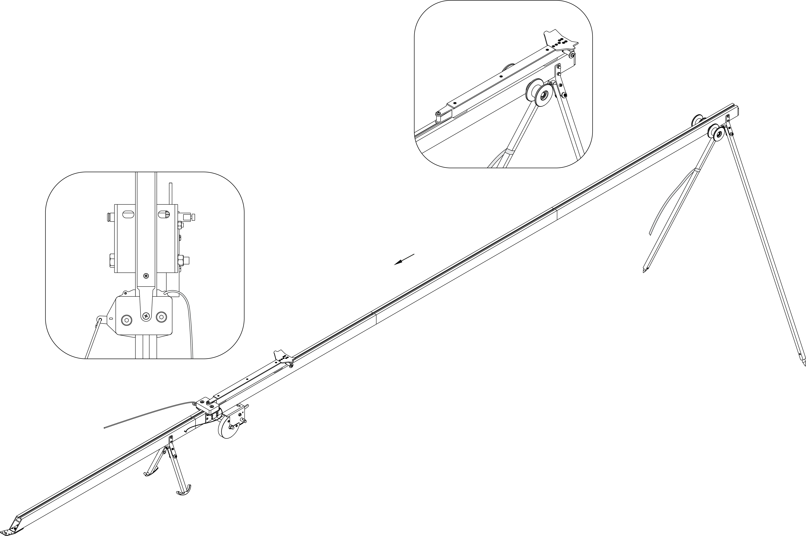

Пусковая установка
=====================

Узлы, детали и принадлежности
---------------------------------
.. figure:: _static/_images/c1.png
   :align: center
   :width: 300

   Каретка

.. figure:: _static/_images/c2.png
   :align: center
   :width: 300

   Передняя часть пусковой установки

.. figure:: _static/_images/c3.png
   :align: center
   :width: 300

   Средняя часть – удлинитель пусковой установки

.. figure:: _static/_images/c4.png
   :align: center
   :width: 300

   Средняя часть пусковой установки с лебедкой

.. figure:: _static/_images/c5.png
   :align: center
   :width: 300

   Задняя часть пусковой установки

.. figure:: _static/_images/c6.png
   :align: center
   :width: 300

   Комплект резиновых жгутов 

.. figure:: _static/_images/c7.png
   :align: center
   :width: 100

   Ручка лебедки

.. figure:: _static/_images/c8.png
   :align: center
   :width: 100

   Кол упорный

   Молоток

Сборка
----------

* Извлеките детали пусковой установки из транспортировочного чехла.

.. figure:: _static/_images/catapult1.png
   :align: center
   :width: 400

   Разложите опоры передней части пусковой установки. Убедитесь, что опоры надежно закреплены механизмами фиксации. 

.. figure:: _static/_images/catapult2.png
   :align: center
   :width: 400

   Присоедините среднюю часть пусковой установки.

.. figure:: _static/_images/catapult3.png
   :align: center
   :width: 400

   Присоедините заднюю часть катапульты.
   Вставьте фиксирующий штифт в отверстие в соединении средней и задней частей пусковой установки.
.. attention:: Запуск БВС разрешен строго против ветра. Категорически запрещается производить запуск БВС по ветру. Невыполнение данного требования может привезти к падению БВС или к столкновению его с препятствиями, поскольку БВС не сможет набрать высоту. В штилевых условиях добавьте на каждую сторону дополнительный виток резиновых жгутов из комплекта ЗИП.

* Установите пусковую установку на ровной поверхности так, чтобы запуск БВС происходил против ветра. Убедитесь, что пусковая установка устойчиво стоит на земле, а ее направляющая не имеет крена. При необходимости заглубите одну из опор для выравнивания конструкции.

* Установите и забейте упорный кол, чтобы предотвратить смещение пусковой установки при запуске БВС.
.. attention:: При запуске БВС рывок резиновых жгутов приводит к подбрасыванию задней части пусковой установки. Чтобы надежно закрепить пусковую установку, забивайте кол на всю длину, добиваясь полной неподвижности задних опорных стоек пусковой установки. Забивая кол, следите за тем, чтобы не деформировать заднюю часть пусковой установки.

.. figure:: _static/_images/catapult4.png
   :align: center
   :width: 400

   Установите каретку на направляющую катапульты так, чтобы направляющие каретки скользили по рельсам.

   .. figure:: _static/_images/catapult6.png
   :align: center
   :width: 400

.. attention:: Убедитесь, что каретка свободно скользит по рельсам, не цепляясь на стыках частей пусковой установки. Осуществляйте проверку свободного движения каретки перед каждым запуском БВС.

* Отведите каретку вниз до фиксации в замке (должно быть два щелчка);

* Вставьте предхранительный штифт в пусковой механизм.

.. attention:: Неисполнение данного требования может привести к случайному срабатыванию замка.

.. attention:: Запуск БВС разрешен строго против ветра. Категорически запрещается производить запуск БВС по ветру. Невыполнение данного требования может привезти к падению БВС или к столкновению его с препятствиями, поскольку БВС не сможет набрать высоту. В штилевых условиях добавьте на каждую сторону дополнительный виток резиновых жгутов из комплекта ЗИП.

   Установите каретку на направляющую пусковой установки со стороны передней части так, чтобы направляющие каретки скользили по рельсам 

* Прокатите каретку по рельсам вниз до ее фиксации в замке (должно быть два щелчка)

.. note:: Убедитесь, что каретка свободно скользит по рельсам, не цепляясь на стыках частей пусковой установки. Осуществляйте проверку свободного движения каретки перед каждым запуском БВС.

.. figure:: _static/_images/catapult8.png
   :align: center
   :width: 400

   Вставьте предохранительный штифт в пусковой механизм. 
* Отпустите стопор лебедки и размотайте натяжной трос.

* Возьмите резиновые жгуты, расправьте кольца, убедитесь, что жгуты не перехлестнуты 

 
.. figure:: _static/_images/catapult10.png
   :align: center
   :width: 250

   Из кольца сделайте петлю и зацепите каретку 

* Второй конец резинового жгута соедините с концом натяжного троса с помощью карабина. Натяжной трос должен проходить через ролик. Карабин обязательно должен быть замуфтован 

* Аналогично присоедините второй резиновый жгут

.. figure:: _static/_images/catapult11.png
   :align: center
   :width: 400

   Установите ручку лебедки и закрепите ее гайкой.

Подготовка пусковой установки к запуску БВС
---------------------------------------------

.. attention:: В целях обеспечения безопасности работ на стартовой площадке и увеличения ресурса резиновых жгутов, натягивайте жгуты непосредственно перед стартом, после успешного проведения предстартовой подготовки.

* Переведите стопор лебедки в положение для натяжения троса.

* Вращая ручку лебедки, натяните резиновые жгуты. Особое внимание следует обратить на карабины во время прохождения их через ролики. При попадании жгута между роликом и направляющей пусковой установки или срыве с ролика, необходимо прекратить натяжение жгутов. Сорвавшийся жгут нужно уложить на ролик, после чего можно продолжить взводить катапульту. 

Натяжение необходимо прекратить, когда карабины, за которые зацеплены жгуты, будут напротив мартера "STOP", выгравированного на пусковой части катапульты. 

Теперь БВС может быть установлен на пусковую установку.

Правила обращения с резиновыми жгутами
--------------------------------------

* Регулярно проверяйте состояние резиновых жгутов. При обнаружении трещин и потертостей, замените паврежденное кольцо на запасное из комплекта ЗИП
* Не держите резиновые жгуты в натянутом состоянии длительное время. Натягивайте жгуты непосредственно пере установкой БВС на пусковую установку
* После запуска БВС снимите резиновые жгуты с поворотных роликов. Для этого одной рукой придерживая ручку лебедки, второй снимите стопор лебедки, и плавно разматывайте натяжной трос. После этого можно снять жгуты с пусковой установки, отсоединив карабин от троса и петлю от каретки. 
* В теплое время года не допускайте длительного нахождения резиновых жгутов под прямыми солнечными лучами. 
* В холодное время года не допускайте замерзания резиновых жгутов. Держите их в теплом месте до установки на пусковую установку и натягивайте непосредственно перед запуском. После запуска БВС немедленно снимите жгуты с пусковой установки и уберите в теплое место. 
  
