Пусковая установка
=====================

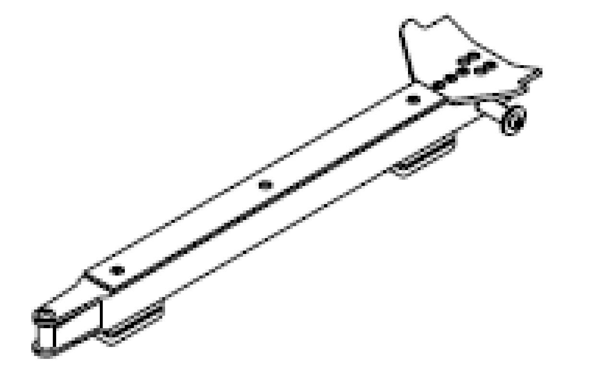

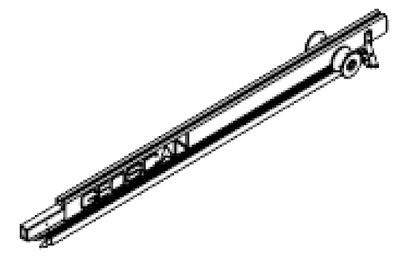

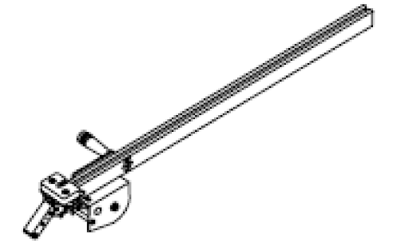

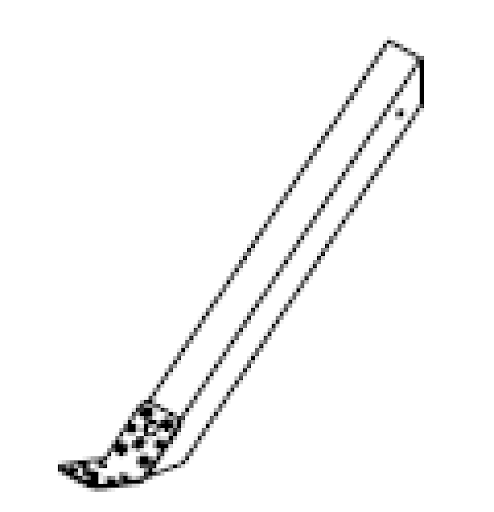

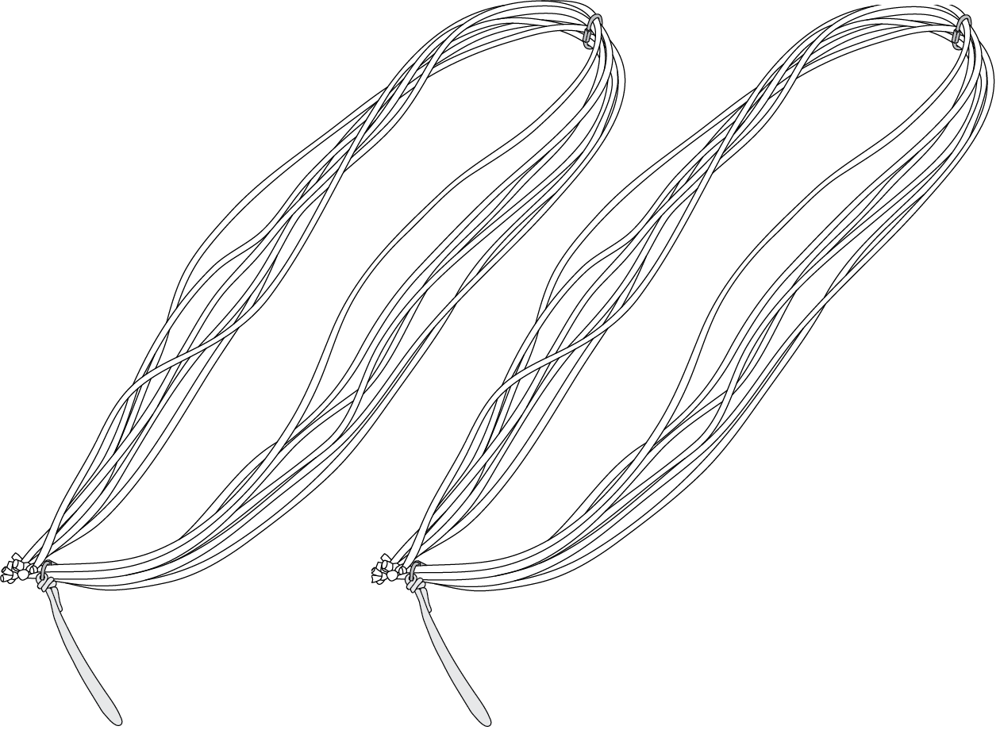

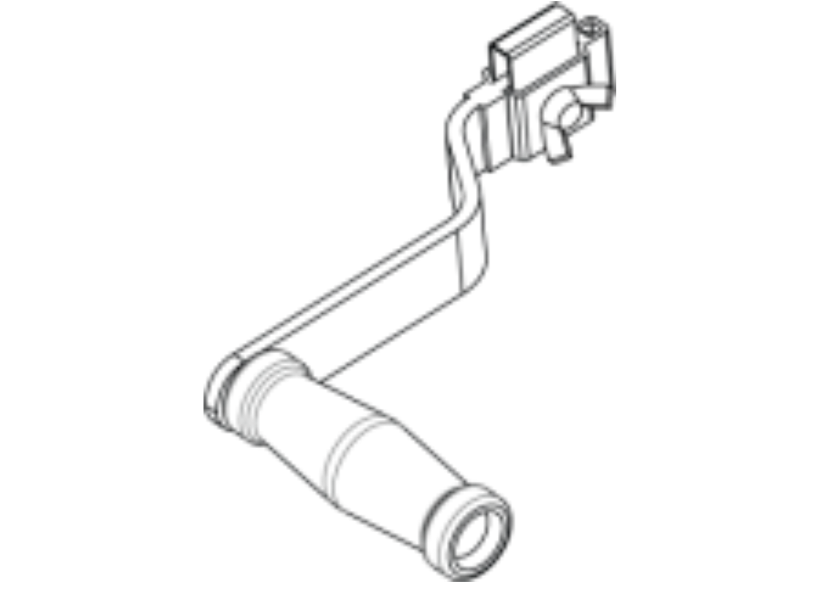

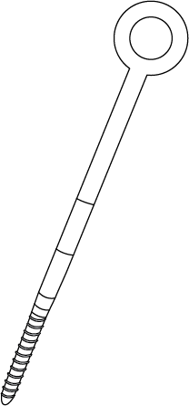

.. |c8| image:: _static/_images/c8.png
    :width: 100

Узлы, детали и принадлежности
---------------------------------

+--------------------------------------------+--------------------------------------------+--------------------------------------------+--------------------------------------------+
|                        |c1|                |                            |c2|            |                     |c3|                   |                    |c4|                    |
+--------------------------------------------+--------------------------------------------+--------------------------------------------+--------------------------------------------+
|                 **Каретка**                |    **Передняя часть пусковой установки**   |     **Средняя часть пусковой установки**   |     **Задняя часть пусковой установки**    |
+--------------------------------------------+--------------------------------------------+--------------------------------------------+--------------------------------------------+
|                    |c5|                    |                    |c6|                    |                       |c7|                 |                         |c8|               |
+--------------------------------------------+--------------------------------------------+--------------------------------------------+--------------------------------------------+
|        **Комплект резиновых жгутов**       |                **Ручка лебедки**           |   **Кол упорный для пусковой установки**   |                  **Молоток**               |
+--------------------------------------------+--------------------------------------------+--------------------------------------------+--------------------------------------------+

Сборка
----------

* Извлеките детали пусковой установки из транспортировочного чехла.

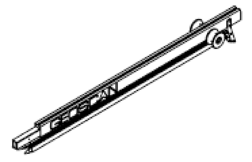

   Разложите опоры передней части пусковой установки. Убедитесь, что они надежно закреплены подпружиненными защелками. Чтобы сложить стойки, оттяните защелки вверх.

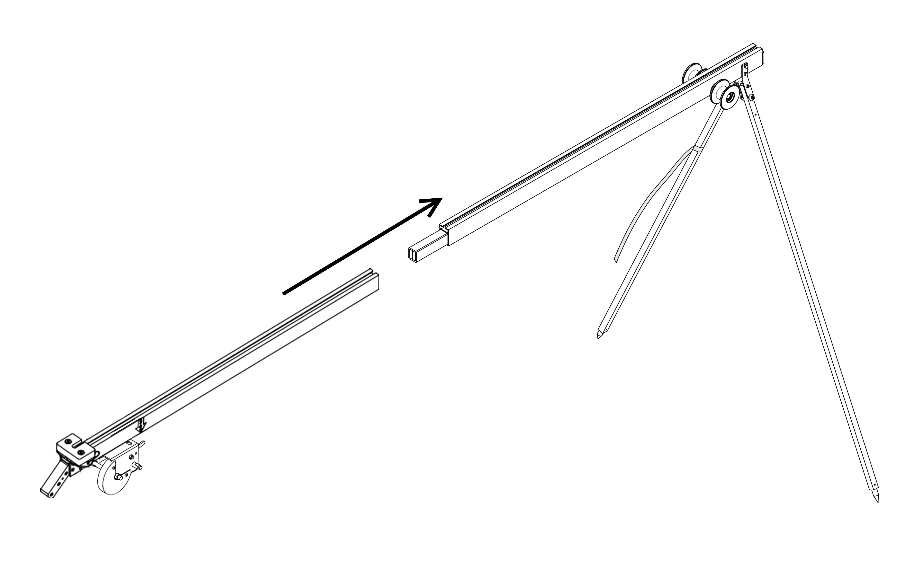

   Присоедините среднюю часть пусковой установки.

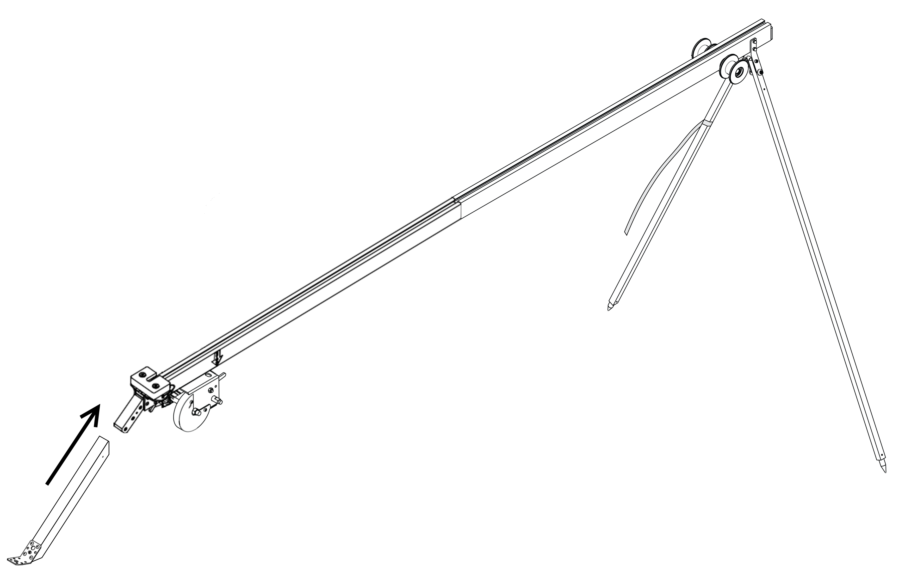

   Присоедините заднюю часть пусковой установки.

* Вставьте фиксирующий штифт в отверстие в соединении средней и задней частей пусковой установки.

* Установите катапульту на ровной поверхности так, чтобы запуск БВС происходил против ветра. Убедитесь, что катапульта устойчиво стоит на земле, а ее направляющая не имеет крена. При необходимости заглубите одну из опор для выравнивания конструкции.

.. attention:: Запуск БВС разрешен строго против ветра. Категорически запрещается производить запуск БВС по ветру. Невыполнение данного требования может привезти к падению БВС или к столкновению его с препятствиями, поскольку БВС не сможет набрать высоту.

* Установите и забейте упорный кол в кронштейн задней части пусковой установки, чтобы предотвратить смещение при запуске БВС.

.. attention:: При запуске БВС рывок резиновых жгутов приводит к подбрасыванию задней части пусковой установки. Чтобы надежно закрепить катапульту, забивайте кол на всю длину, добиваясь полной неподвижности задних опорных стоек пусковой установки. Забивая кол, следите за тем, чтобы не деформировать заднюю часть пусковой установки.

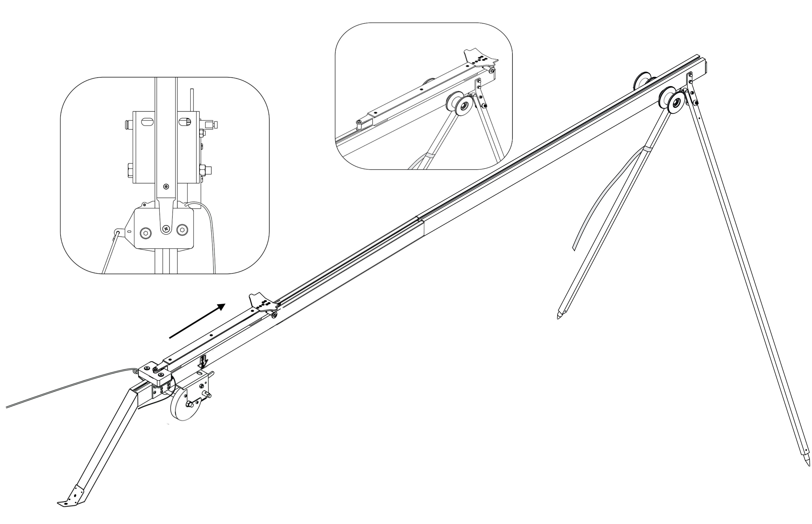

   Установите каретку на направляющую пусковой установки так, чтобы направляющие каретки скользили по рельсам.

.. attention:: Убедитесь, что каретка свободно скользит по рельсам, не цепляясь на стыках частей пусковой установки. Осуществляйте проверку свободного движения каретки перед каждым запуском БВС.

* Отведите каретку вниз до фиксации в замке (должно быть два щелчка);

.. figure:: _static/_images/catapult8.png
   :align: center
   :width: 400

   Вставьте предохранительный штифт в пусковой механизм. 

.. attention:: Неисполнение данного требования может привести к случайному срабатыванию замка.

* Отпустите стопор лебедки и размотайте натяжной трос.

* Возьмите резиновые жгуты, расправьте кольца, убедитесь, что жгуты не перехлестнуты 

 
.. figure:: _static/_images/catapult10.png
   :align: center
   :width: 250

   Из кольца сделайте петлю и зацепите каретку 

* Второй конец резинового жгута соедините с концом натяжного троса с помощью карабина. Натяжной трос должен проходить через ролик. Карабин обязательно должен быть замуфтован 

* Аналогично присоедините второй резиновый жгут.

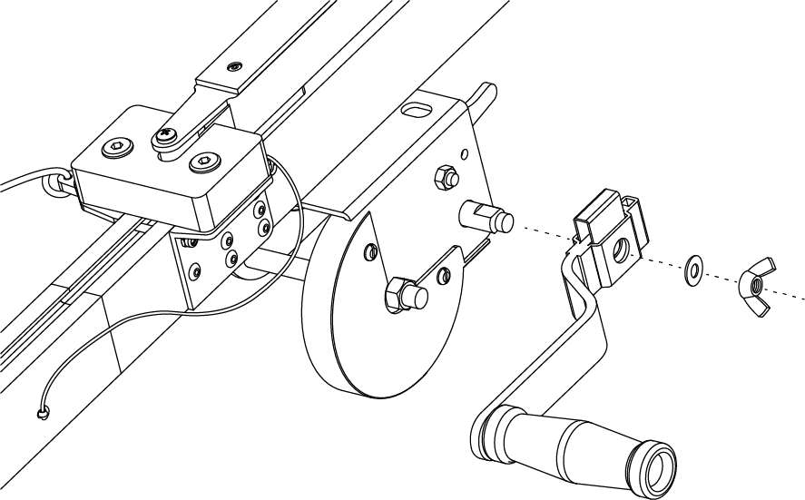

   Установите ручку лебедки и закрепите ее гайкой.

Подготовка пусковой установки к запуску БВС
---------------------------------------------

.. attention:: В целях обеспечения безопасности работ на стартовой площадке и увеличения ресурса резиновых жгутов, натягивайте жгуты непосредственно перед стартом после успешного проведения предстартовой подготовки.

* Переведите стопор лебедки в положение для натяжения троса.

* Вращая ручку лебедки, натяните резиновые жгуты. Особое внимание следует обратить на карабины во время прохождения их через ролики. При попадании жгута между роликом и направляющей пусковой установки или срыве с ролика, необходимо прекратить натяжение жгутов. Сорвавшийся жгут нужно уложить на ролик, после чего можно продолжить взводить пусковую установку. 

Натяжение необходимо прекратить, когда карабины, за которые зацеплены жгуты, будут напротив маркера "STOP", выгравированного на пусковой части пусковой установки. 

Теперь БВС может быть установлен на пусковую установку.

Правила обращения с резиновыми жгутами
--------------------------------------

* Регулярно проверяйте состояние резиновых жгутов. При обнаружении трещин и потертостей, замените поврежденное кольцо на запасное из комплекта ЗИП.
* Не держите резиновые жгуты в натянутом состоянии длительное время. Натягивайте жгуты непосредственно пере установкой БВС на пусковую установку.
* После запуска БВС ослабьте (или снимите) натяжение резиновых жгутов. Для этого одной рукой придерживая ручку лебедки, второй - (ну или написать "рукой) снимите стопор лебедки, и плавно разматывайте натяжной трос. После этого можно снять (можно не снимать - пусть висят полностью ослабленные, если не мороз) жгуты с пусковой установки, отсоединив карабин от троса и петлю от каретки. 
* В теплое время года не допускайте длительного нахождения резиновых жгутов под прямыми солнечными лучами. 
* В холодное время года не допускайте замерзания резиновых жгутов. Держите их в теплом месте до установки на пусковую установку и натягивайте непосредственно перед запуском. После запуска БВС немедленно снимите жгуты с пусковой установки и уберите в теплое место. 
  
