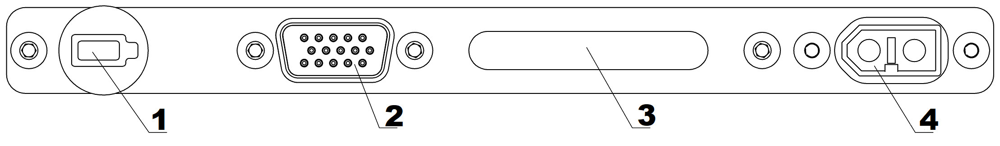

Зарядная станция и АКБ
=========================

.. csv-table:: **Характеристики АКБ**
   
   "Гарантированное количество циклов заряд-разряд", "80"
   "Верхний предел заряда", "16.8 В"
   "Нижний предел разряда", "13.2 В"
   "Ток заряда", "<10 А"
   "Количество ячеек", "4"
   "Емкость", "16 000 мА·ч"

Техника безопасности
----------------------
**АКБ:**

* Запрещается разбирать АКБ;
* Запрещается использовать нештатные зарядные устройства и кабели для зарядки АКБ;
* Не оставляйте АКБ надолго под прямыми солнечными лучами;
* Не допускайте длительное хранение и транспортировку АКБ при температуре ниже + 3 °С;
* Не допускайте короткого замыкания контактов АКБ.

**Зарядная станция:**

* перед подключением АКБ к зарядному устройству необходимо предварительно включить зарядное устройство;

* перед каждым использованием необходимо производить осмотр кабелей и разъемов на предмет повреждений;

* запрещается эксплуатировать зарядное устройство под прямыми солнечными лучами;

* запрещается эксплуатировать зарядное устройство без присмотра.

С завода комплекс поставляется с настроенным зарядным устройством. Если настройки сбились - следуйте инструкции, чтобы их восстановить.

Предварительные настройки зарядного устройства
----------------------------------------------------

Чтобы войти в меню настроек, необходимо:

* на экране PROGRAM SELECT (основной экран) многократно нажать кнопку Batt type/Stop, пока на дисплее не появится раздел Settings;

* подтвердить выбор нажатием кнопки Start/Enter.

* навигация по меню настроек осуществляется при помощи кнопок Dec/Inc

В меню Settings необходимо установить следующие настройки:

* снять ограничение времени заряда. Для этого необходимо при помощи кнопок Dec/Inc выбрать экран Safety timer:

При нажатии кнопки Start/Enter станет активна функция изменения ON/OFF, кнопкой Dec/Inc выберите положение OFF, затем нажмите Start/Enter пока на экране не перестанут мигать настройки.

* снять ограничение емкости заряжаемой АКБ. Для этого необходимо при помощи кнопок Dec/Inc выбрать экран Capacity cut-off. 

При нажатии кнопки Start/Enter станет активна функция изменения ON/OFF, кнопкой Dec/Inc выберите положение OFF, затем нажмите Start/Enter пока на экране не перестанут мигать настройки.

Для выхода из раздела Settings нажмите кнопку Batt type/Stop.

* На экране PROGRAM SELECT (основной экран) при помощи Dec/Inc выберите пункт Lithium battery и подтвердите нажатием кнопки Start/Enter, затем выберите следующие настройки:

Параметр AUTO в автоматическом режиме определяет количество ячеек (S) в аккумуляторе. Остальные значения в меню настроек менять не рекомендуется.

Зарядка может производиться либо от сети, либо от автомобильной АКБ.

Порядок подключения АКБ к зарядному устройству
-----------------------------------------------------

* Подключите балансировочный разъем
* Подключите положительную клемму (красный провод)
* Подключите отрицательную клемму (черный провод)

.. Attention:: 
 При зарядке от автомобильной АКБ, убедитесь, что двигатель автомобиля запущен, иначе автомобильная АКБ полностью разрядится в процессе зарядки.

**Рекомендации**

* Если полеты проходят при температуре воздуха ниже 0 °C, перед полетом необходимо хранить АКБ в теплом месте и не допускать его охлаждения. Следует помнить, что на холоде литий-полимерные АКБ могут терять до 30% своей емкости, данное обстоятельство необходимо учитывать при построении полетного задания;

* Если полеты проходят при температуре воздуха свыше 25 °C, перед полетом необходимо хранить АКБ в прохладном, защищенном от попадания прямых солнечных лучей месте. После полета нельзя сразу заряжать АКБ, необходимо дать ей остыть. Заряжать также необходимо в прохладном месте, защищенном от попадания прямых солнечных лучей. 

Плата индикации АКБ
------------------------

   индикаторы и разъемы на корпусе АКБ

Нажмите на кнопку (1), чтобы просмотреть статус АКБ. После нажатия светодиодная полоса (3) отобразит уровень заряда зелеными делениями, затем красными делениями - внутреннюю температуру (см. таблицу). 

.. csv-table:: **индикация температуры АКБ**
   :header: "Количество светодиодов", "Режим свечения", "Температура, С"
   

   "I", "мигает", "< 5"
   "II", "мигает", "5-10"
   "III", "мигает", "10-15"
   "IIII", "горит", "15-20"
   "IIIII", "горит", "20-25"
   "IIIIII", "горит", "25-30"
   "IIIIIII", "мигает", "30-35"
   "IIIIIIII", "мигает", "35-40"
   "IIIIIIIII", "мигает", "40-45"
   "IIIIIIIIII", "мигает", ">=45"

После этого светодиодная полоса загорится желтым цветом, и деления начнут гаснуть одно за другим. Пока не погасло последнее деление, вы можете перевести батарею в режим поддержания температуры (модификация "Арктика"), или подключить АКБ к БВС для обмена информацией с бортовой электроникой.

.. Attention:: 
 Внимание! Не подсоединяйте внешний источник питания к АКБ при активированном режиме индикации.

.. csv-table:: **Ключевые значения заряда АКБ**
   :header: "Тип АКБ", "Заряжен", "Половина заряда", "Заряд близок к нулю", "Разряжен", "Потеря питания, выход АКБ из строя"

   "5S", "21,0 В", "18.5,0 В", "16.5,0 В", "15,0 В", ">15,0 В"

Скорость разряда АКБ определяется уровнем "газа", который зависит от погодных условий и траектории маршрута. При построении полигона, желательно делать его прямоугольным с минимальным количеством разворотов и максимально протяженными “галсами”. Следуя данным рекомендациям, вы увеличите эффективность полетов.

.. Attention:: 
 Внимание! Во время полета, при снижении уровня заряда до 3,5 В на ячейку, АКБ начнет разряжаться быстрее.

Управление обогревом АКБ (для комплексов с модификацией «Арктика»)
-------------------------------------------------------------------

АКБ модификации «Арктика» отличаются пиктограммой снежинки на корпусе. Использование таких АКБ допускается при температуре окружающей среды от -40 °C до +20 °C.

Если в режиме индикации нажать и удерживать кнопку (1) более 2 секунд, светодиодная полоса загорится оранжевым, и батарея активирует режим поддержания температуры +(20÷30) °С на 30 минут. При этом светодиодная полоса отображает оставшееся время обогрева (каждое деление – 3 мин). Повторное длительное нажатие кнопки (1) выключит режим поддержания температуры.

Возможные неисправности и их устранение
-------------------------------------------

Если после нажатия кнопки (1) на панели АКБ крайний правый светодиод на полосе загорится красным, это сигнализирует о появлении ошибки в системе. Светодиоды №№ 1 и 2 слева отображают код неисправности.

* горит светодиод 1 - ошибка внутренней связи. Повторите попытку через несколько секунд. Если проблема возникает часто, обратитесь к производителю.
* горит светодиод 2 - низкое напряжение на ячейке. Если после заряда АКБ ошибка не исчезает, обратитесь к производителю.
* одновременно горят светодиоды 1 и 2 - низкое напряжение внешнего источника. Замените внешний источник на исправный. Если АКБ подключена к автомобильному аккумулятору, запустите двигатель.

Утилизация АКБ
-----------------

Не выбрасывайте LiPo батареи в контейнеры для бытового мусора. Неправильная утилизация отработавших источников питания может представлять опасность для окружающей среды. Пожалуйста, утилизируйте LiPo батареи в соответствии с местным законодательством, сдавая их в ближайшие пункты переработки.

