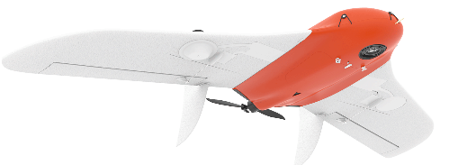

.. 101-doc documentation master file, created by
   sphinx-quickstart on Fri Dec 21 11:13:03 2018.
   You can adapt this file completely to your liking, but it should at least
   contain the root `toctree` directive.

Сборка и эксплуатация комплекса Геоскан Lite
=====================================================

Общие сведения
-----------------------

Геоскан Lite – компактный аэрофотосъемочный комплекс, позволяющий выстраивать фотографическую карту местности, матрицу высот или 3D-модель территории.

**Назначение**

Комплекс Геоскан Lite предназначен для получения геопривязанных фотографий объектов и площадной аэрофотосъёмки.

**Область применения**

Полученные с использованием комплекса материалы могут использоваться для:

* Оценки состояния местности;
* Выполнения аэрофотосъемки местности с фиксацией моментов фотографирования для получения геопривязанных фотографий;
* Создания ортофотопланов и цифровых моделей местности по материалам аэрофотосъемки;
* Создания карт высот;
* Создания 3D моделей местности;
* Вычисления объемов пород в карьерах и насыпных объектах.

.. csv-table:: **Технические характеристики**
   :header: "Параметр", "Значение"

   "Тип БВС", "летающее крыло"
   "Скорость полета (воздушная)", 65 - 86 км/ч
   "Максимальная взлетная масса", "3,1 кг"
   "Максимальная масса полезной нагрузки", "0,8 кг"
   "Площадь фотосъемки за один полет","3 - 9 км²"
   "Допустимая скорость ветра","до 12 м/с"
   "Размах крыла", "1,38 м"
   "Минимальная безопасная высота полета","100 м"
   "Максимальная высота полета","4000 м"
   "Двигатель","электрический, бесколлекторный"
   "Аккумуляторная батарея","LiPo 14,8 В"
   "Время подготовки к взлету","10 мин"
   "Продолжительность полета", "до 60 мин"
   "Максимальная протяженность маршрута","70 км"
   "Взлет","с катапульты"
   "Посадка","на парашюте, в автоматическом режиме"
   "Рабочий диапазон температур:",""
   от -20 до +40 °С"

Комплект поставки
---------------------

* Беспилотное воздушное судно (БВС) Геоскан Lite
* Транспортировочный кейс БВС
* Катапульта в транспортировочной сумке
* Полезная нагрузка:
   * модернизированный фотоаппарат Sony A6000
* Аккумуляторная батарея (АКБ) LiPo 14,8 В
* Модем КРЛ
* Стойка для модема КРЛ
* Раскладная подставка для сборки планера
* Зарядное устройство для АКБ
* Комплект ЗиП:
   * Киль - 2 шт
   * Комплект резиновых жгутов для катапульты
   * Шомпол приемника воздушного давления
   * Приемник воздушного давления
   * Лопасти воздушного винта 10x8
   * Кабель USB для фотоаппарата

Техническое обслуживание
-------------------------

После каждого полета провести визуальный осмотр БВС на предмет повреждений.

В случае повреждения лопастей винта или килей вы можете произвести замену самостоятельно, используя запасные части и инструменты из комплекта.

При выявлении конструкционных повреждений планера или систем необходимо обратиться на завод-изготовитель.

После выполнения 80 полетов рекомендуется отправить БВС на завод-изготовитель для проверки и технического обслуживания.

Хранение
-----------

Комплекс Геоскан Lite (без аккумуляторных батарей) хранить в транспортировочном кейсе (пусковую установку – в сумке) в сухих помещениях при температуре от 5 до 25 °С и относительной влажности не более 80%, без конденсации. Срок хранения - 2 года.

Аккумуляторные батареи хранить в сухом прохладном месте, исключающем воздействие прямых солнечных лучей, при температуре от 5 до 25 °С и относительной влажности не более 80%, без конденсации. Оптимальная температура — от 5 до 10 °С. Оптимальный уровень напряжения АКБ при помещении батареи на хранение: 15,12 В. Срок хранения - 1 год.

.. toctree::
   :maxdepth: 2
   :caption: Содержание:

   reference
   precautions
   uav
   nsu
   catapult
   camera
   charger
   launch

