Использование Geoscan Planner
==============================

Предварительная настройка
-----------------------------------

1) Подключить модем КРЛ к USB порту ноутбука.
2) Включить бортовое питание БЛА.

3) Запустить программу **MdmDisp**.

В правом нижнем углу появится пиктограмма антенны и количество подключенных бортов.

.. figure:: _static/_images/planner1.png
   :align: center
   :width: 100

   Индикатор работы программы MdmDisp

3.1 При первом подключении необходимо настроить соединение с БВС, запустив программу **NetTopology**:

* Нажать на иконку **Поиск новых устройств**.

.. figure:: _static/_images/planner29.png
   :align: center
   :width: 200

   Иконка поиска новых устройств

Программа отобразит список обнаруженных модемов.

.. note:: Эфир сканируется до тех пор, пока кнопка **Поиск новых устройств** не будет нажата повторно.

* Выбрать появившийся Борт №xxx и нажать на иконку **Добавить устройство**.

.. figure:: _static/_images/planner30.png
   :align: center
   :width: 300

   Иконка добавления устройства

Программа сохраняет список добавленных устройств.

При проведении повторных полетов достаточно запустить **MdmDisp** и убедиться, что подключение выполнено успешно.

Если БЛА не обнаружен, запустить поиск бортовых модемов, нажав на иконку **MdmDisp** правой кнопкой мыши и выбрав **Переподключить**.

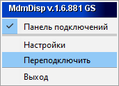

   Контекстное меню MdmDisp

4) Запустить программу **Geoscan Planner**.
5) В окне ввода логина и пароля ввести свой логин/пароль пользователя продукта.
6) Во вкладке **Полет** выбрать **Подключить БЛА - Поиск...**

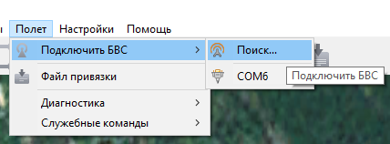

   Подключение БЛА

7) Выбрать тип подключения **MdmDisp**. Задать **IP-адрес** *localhost*. В списке **Борт** установить для **БЛА Порт 6**.

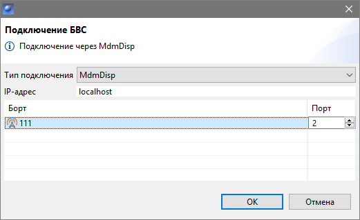

   Окно подключения БЛА

.. note:: Параметры достаточно установить один раз. При последующих подключениях БЛА воспользуйтесь кнопкой **Подключить БЛА** панели инструментов. Приемник автоматически определит координаты и отобразит местоположение БЛА на карте. В окне программы появятся панель телеметрии (слева) и панель приборов (справа).

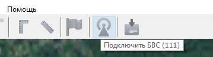

   Подключение БЛА

Проектирование полетного задания
----------------------------------------

1) Создайте **Новый проект**.

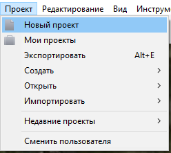

   Создание нового проекта

Укажите имя проекта, параметры съемки, модель БЛА и фотоаппарата.

.. figure:: _static/_images/planner6.png
   :align: center
   :width: 500

   Создание нового проекта полетного задания

Площадная аэрофотосъемка
-------------------------------------------
Площадная аэрофотосъемка – съемка полигонов. Полигон – это область, ограниченная многоугольником. Оператор задает вершины многоугольника (не менее 3), а программа автоматически рассчитывает маршрут обхода.

1) Нажмите на иконку **Создать площадную аэрофотосъемку** на панели инструментов.

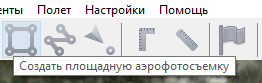

   Создание площадной аэрофотосъемки

2) Задайте на карте угловые точки исследуемого участка местности. Программа автоматически рассчитает маршрут обхода полигона. При построении маршрута отображаются набор высоты и снижение БЛА в виде цилиндров, если разница высот соседних точек превышает 30 метров. Если БЛА набирает высоту, то цилиндр залит оранжевым цветом, иначе – синим.

.. figure:: _static/_images/planner9.png
   :align: center
   :width: 500

   Цилиндры набора высоты и снижения

Добавление и удаление вершин полигона
__________________________________________
В готовый полигон можно добавлять вершины. Для этого нажмите правой кнопкой мыши на любую вершину. В выпадающем списке выберите **Добавить вершину**. Новая вершина появится на середине грани. После создания ее можно перетащить в нужное место. Аналогично происходит удаление вершин.

.. figure:: _static/_images/planner10.png
   :align: center
   :width: 500

   Добавление вершины

Изменение направления линий облета
_______________________________________
Необходимость оптимизировать полигон «по направлению» возникает, например, если на месте проведения работ сила и направление ветра неблагоприятны (сильный ветер вдоль линий облета полигона).
Для изменения типа оптимизации щелкните правой кнопкой мыши на полигоне и выберите в контекстном меню вариант **Оптимизация «направление»**.

.. figure:: _static/_images/planner11.png
   :align: center
   :width: 500

   Оптимизация по направлению

Одна из вершин полигона будет подсвечена, на ней появится бегунок для задания направления.

.. figure:: _static/_images/planner12.png
   :align: center
   :width: 500

   Корректировка направления облета

Результатом будет новый маршрут облета полигона по заданному направлению.

.. figure:: _static/_images/planner13.png
   :align: center
   :width: 500

   Новый маршрут облета

Изменение точки входа
________________________
Если необходимо сменить точку входа в полигон, то выполните следующие действия:

1) Выделите полигон.

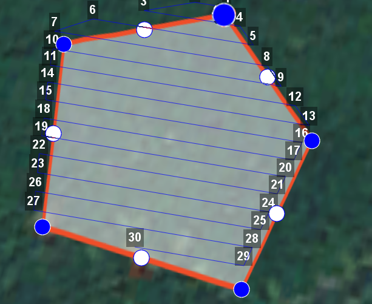

   Выделенный полигон

2) Правой кнопкой мыши выделите точку, в которой нужно осуществить вход. 
3) В появившемся контекстном меню выберите **Начать здесь**.

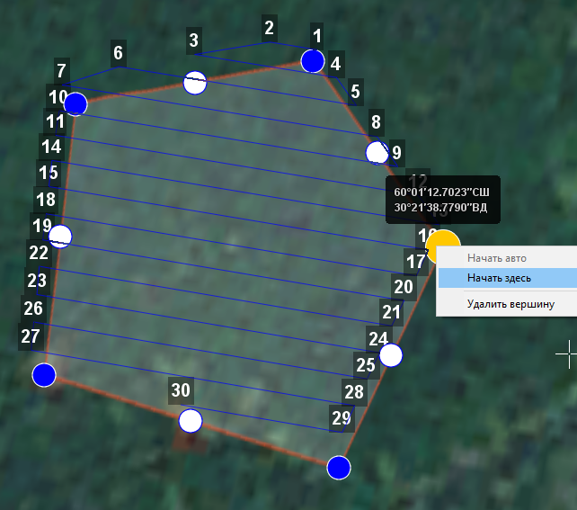

   Изменение точки входа в полигон

.. |flag| image:: _static/_images/flag.png
    :width: 50

У выбранной точки входа появится флажок |flag|

Линейная аэрофотосъемка
---------------------------
Линейная аэрофотосъемка служит для облета линейных протяженных объектов, таких как: реки, дороги, ЛЭП, газо- и нефтепроводы.

1) Нажмите на иконку **Создать линейную аэрофотосъемку** на панели инструментов.

.. figure:: _static/_images/planner16.png
   :align: center
   :width: 500

   Создание области линейной аэрофотосъемки

2) Однократными щелчками задайте маршрут обхода протяженного объекта по точкам разворотов. Программа автоматически построит линии облета.

.. figure:: _static/_images/planner17.png
   :align: center
   :width: 500

   Пример линейной аэрофотосъемки

Изменение параметров БЛА в точках разворота
_______________________________________________
По умолчанию поведение БЛА в точках разворота выбирается автоматически с учетом угла между соседними линиями (развороты на углы до заданного угла автопролета осуществляются пролетом).
Для изменения параметров прохождения конкретной вершины щелкните по ней правой кнопкой мыши и выберите нужный параметр разворота.

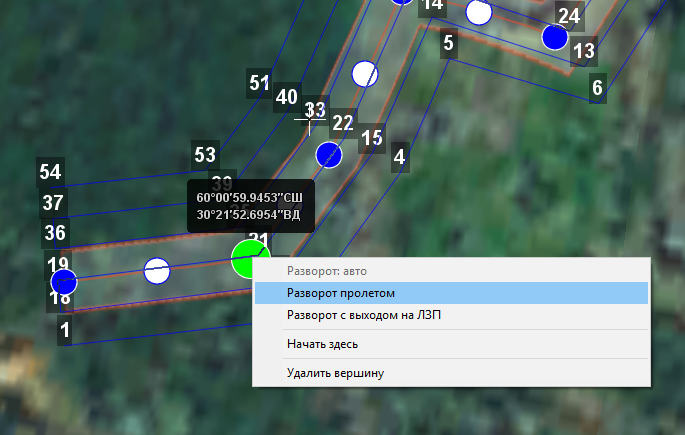

   Настройка параметров прохождения вершины

* **Разворот с выходом на ЛЗП** *(линия заданного пути)* означает, что БЛА полностью пролетит галс, а затем зайдет на следующий галс с дополнительным маневром («петлей»). Этот вариант гарантирует съемку территории под маршрутом в полном объеме, и он предпочтителен в случае резких разворотов.
* **Разворот пролетом** может с успехом применяться при съемке рек и других естественных объектов, не имеющих выраженных точек разворота. Это более быстрый способ разворота, но он плохо подходит для резких разворотов (крайние части территории под линиями маршрута могут оказаться вне зоны съемки).

Перелет
----------------
Добавление перелетов в полетное задание необходимо, если в зоне полета могут оказаться точечные высотные объекты (опоры ЛЭП, трубы и т.п.). 

1) Нажмите на иконку **Создать перелет** на панели инструментов.

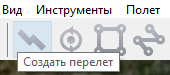

   Создание перелета

2) Однократными щелчками задайте маршрут  перелета. Для построения перелёта на разных высотах, выберите в окне «Свойства» **Режим высоты точек – Нефиксированный**.

.. figure:: _static/_images/planner20.png
   :align: center
   :width: 500

   Свойства перелета

* Функция «Выполнять фотографирование» активирует работу фотоаппарата.

Шаг фотографирования в метрах указывается в соответствующее поле.
Значения в столбце **Превышение** – это разность абсолютной высоты точки ПЗ и рельефа под ней. Таким образом, высота рельефа обязательно учитывается. Абсолютные высоты точек также доступны для редактирования через столбец **Высота**. Кроме этого, высоту можно изменять визуальным редактированием (потянуть мышкой с нажатой клавишей *Shift*).

Маршрут перелёта между двумя полётными элементами строится по следующим правилам:
1) Если у полётных элементов одинаковая высота, то перелёт будет на этой
же высоте.
2) Если у полётных элементов разные высоты, то перелёт будет на наибольшей
из двух высот.

При выбранном варианте "нефиксированный" можно настроить вариант полёта между соседними точками через контекстное меню точки перелета. По умолчанию самолёт набирает/сбрасывает высоту по спирали, если разница высот соседних точек превышает 30 м.
В перелете можно выбрать вариант плавного набора, для этого необходимо щелкнуть правой кнопкой мыши по точке перелета и выбрать вариант **«Перелет только по прямой»**.

.. figure:: _static/_images/planner21.png
   :align: center
   :width: 800

   Выбор варианта перелета по прямой

.. attention:: Если условия не позволяют достичь высоты второй точки по прямой (например, небольшое расстояние между точками, но большая разница высот), самолет полетит с максимально допустимым тангажом по прямой до достижения заданной точки по координатам, после чего наберет/сбросит высоту по спирали.

Точка ожидания
------------------------
Команда **Создать точку ожидания** служит для удержания точки на высоте в течение отрезка времени. Позволяет измерять направление и силу ветра на высоте.

1) Нажмите на иконку **Создать точку ожидания** на панели инструментов.

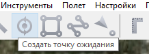

   Создание точки ожидания

2) Щелчком мыши на карте задайте точку, в которой должно осуществляться ожидание.

В экспертном режиме можно изменить свойства: задать высоту точки ожидания, длительность ожидания, направление движения и активировать функции измерения ветра и бесконечного ожидания.

.. figure:: _static/_images/planner23.png
   :align: center
   :width: 500

   Свойства точки ожидания

Планер будет на заданной высоте «удерживать» точку в течение указанного времени (по умолчанию 300 секунд), после чего отправится по запланированному маршруту.

При активации варианта «Измерение ветра» длительность автоматически выставляется в значение 0. При этом точка ожидания окрасится в желтый цвет. Самолет выполняет полный оборот с постоянным измерением ветра.

.. figure:: _static/_images/planner24.png
   :align: center
   :width: 500

   Точка измерения ветра

Функция бесконечного ожидания служит для постоянного удержания точки (пока не сработает отказ по низкому заряду АКБ, приводящий к автоматическому возврату). При этом цвет точки ожидания сменяется на темно-синий.

.. figure:: _static/_images/planner25.png
   :align: center
   :width: 500

   Точка бесконечного ожидания

.. attention:: Рекомендуется устанавливать точку ожидания с измерением ветра перед каждым полетным элементом на высоте полётного элемента. Автопилот, учитывая измеренные данные о ветре, будет плавнее идти по маршруту.
.. attention:: Комплексы Геоскан не являются сертифицированными приборами измерения ветра, поэтому не могут быть использованы в качестве надежных источников данных о состоянии окружающей среды.

Маршрут посадки
--------------------------------
Команда **Создать посадку** служит для построения маршрута посадки.

Это обязательное действие при построении полетного задания.

На месте проведения полета определите направление ветра, скорректируйте при необходимости зону полета и выберите место посадки.
Для посадки следует выбирать открытое сухое пространство без деревьев и прочих препятствий.
Площадка для посадки должна быть ровной, желательно с травяным покровом.

1) Нажмите на иконку **Создать посадку** на панели инструментов.

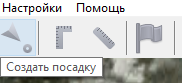

   Создание посадки

2) Щелчком клавиши мыши выберите сначала точку посадки, затем точку захода на посадку.

Программа автоматически создаст маршрут посадки из трех точек (промежуточная точка создается автоматически).

.. figure:: _static/_images/planner32.png
   :align: center
   :width: 500

   Пример посадки

.. attention:: Важно, чтобы посадка осуществлялась против ветра в области посадки. В противном случае возможна жесткая посадка, приводящая к повреждениям самолета.

Предстартовая подготовка
----------------------------

1) Запустите **Мастер предстартовой подготовки**.

.. figure:: _static/_images/planner26.png
   :align: center
   :width: 300

   Запуск мастера предстартовой подготовки

Следуйте указаниям мастера предстартовой подготовки (большинство проверок выполняются автоматически).
Задайте радиус автоматического отцепа парашюта и время автономного полёта (время, в течение которого осуществляется полёт независимо от наличия связи между НСУ и БЛА).
После прохождения предстартовой подготовки установите БЛА на пусковую установку.

Полет
----------------------------

1) Нажмите на иконку **Старт**.

.. figure:: _static/_images/planner27.png
   :align: center
   :width: 300

   Перевод БЛА в стартовый режим

БЛА перейдет в стартовый режим. 
На панели телеметрии отобразится режим **КАТАПУЛЬТА**.

.. figure:: _static/_images/planner28.png
   :align: center
   :width: 400

   Режим КАТАПУЛЬТА

.. attention:: Переводить БЛА в стартовый режим необходимо после установки на пусковую установку. После перехода в стартовый режим запрещается брать в руки и переносить БЛА.

.. attention:: Чтобы отменить переход в режим Катапульта, нажмите кнопку **Возврат**. БЛА перейдет в режим Подготовка. Мастер предстартовой подготовки необходимо будет пройти заново.

2) Снимите предохранитель и активируйте пусковую установку, потянув за спусковой шнур. 

БЛА осуществит взлёт.

