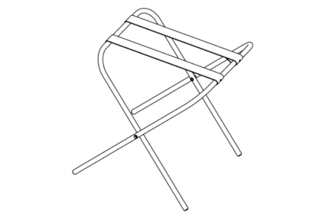

БВС
============

Узлы и детали 
---------------------------

.. |body| image:: _static/_images/body.png
    :width: 400

.. |left_wing| image:: _static/_images/left_wing.png
    :width: 400

.. |right_wing| image:: _static/_images/right_wing.png
    :width: 400

.. |kiel| image:: _static/_images/kiel.png
    :width: 400

.. |parashute| image:: _static/_images/parashute.png
    :width: 400

.. |pin| image:: _static/_images/pin.png
    :width: 400

.. |charger| image:: _static/_images/charger.png
    :width: 400

.. |akb| image:: _static/_images/akb.png
    :width: 400

.. |zip| image:: _static/_images/zip.png
    :width: 400

+--------------------------------------------+--------------------------------------------+--------------------------------------------+--------------------------------------------+
|                        |body|              |                            |left_wing|     |                     |right_wing|           |                   |kiel|                   |
+--------------------------------------------+--------------------------------------------+--------------------------------------------+--------------------------------------------+
|                 **Фюзеляж**                |            **Левая консоль крыла**         |        **Правая консоль крыла**            |                    **Киль**                |
+--------------------------------------------+--------------------------------------------+--------------------------------------------+--------------------------------------------+
|                |parashute|                 |                   |pin|                    |                    |stand|                 |                     |sonya6000|            |
+--------------------------------------------+--------------------------------------------+--------------------------------------------+--------------------------------------------+
|                **Парашют**                 |      **Штырь соединительный (455 мм)**     |        **Подставка для сборки БВС**        |**Модернизированный фотоаппарат Sony A6000**|
+--------------------------------------------+--------------------------------------------+--------------------------------------------+--------------------------------------------+
|                 |charger|                  |                    |akb|                   |                    |case|                  |                  |zip|                     |
+--------------------------------------------+--------------------------------------------+--------------------------------------------+--------------------------------------------+
|       **Зарядное устройство для АКБ**      |          **Аккумуляторная батарея**        |       **Транспортировочный кейс БВС**      |                 **ЗИП**                    |
+--------------------------------------------+--------------------------------------------+--------------------------------------------+--------------------------------------------+

Сборка 
-------------

1) Извлеките консоли крыла и фюзеляж из транспортировочного кейса.
2) Уложите парашют в соответствующий отсек в фюзеляже (порядок укладки см. в разделе `Парашютная система`_).
3) Снимите верхнюю крышку фюзеляжа. Для этого отстегните резиновые фиксаторы на носовой части фюзеляжа, затем выньте заднюю часть крышки из пазов.

.. figure:: _static/_images/asmbl1.png
   :align: center
   :width: 400
   :alt: Снятие крышки фюзеляжа 

   Снятие крышки фюзеляжа

4) Вставьте длинный соединительный штырь в трубку фюзеляжа.

.. figure:: _static/_images/asmbl2.png
   :align: center
   :width: 400
   :alt: Фюзеляж, вид «сбоку-сверху»

   Вставка соединительного штыря

5) Наденьте консоль крыла на соединительные штыри и продвиньте к фюзеляжу так, чтобы она зашла в паз на фюзеляже и уперлась в ограничители. 
   Аналогично установите другую консоль. 

.. figure:: _static/_images/asmbl3.png
   :align: center
   :width: 400
   :alt: Консоль крыла 

   Установка консоли крыла

6) Установите кили в консоли. Убедитесь, что кили зафиксированы магнитами.

.. figure:: _static/_images/asmbl4.png
   :align: center
   :width: 400
   :alt: Установка килей 

   Установка килей

7) Подключите разъемы кабельных сборок консолей в соответствующие гнезда автопилота.

.. figure:: _static/_images/asmbl5.png
   :align: center
   :width: 400
   :alt: Подключение кабелей консолей

   Подключение кабелей консолей

8) Выньте карту памяти microSD из автопилота и отформатируйте ее, затем установите на место.
9) Установите АКБ и закрепите с помощью текстильной застежки.
10) Подключите разъем питания.

.. figure:: _static/_images/asmbl6.png
   :align: center
   :width: 400
   :alt: Подключение питания

   Установка карты microSD. Установка АКБ. Подключение питания.

11) Закройте верхнюю крышку фюзеляжа. Для этого сначала зафиксируйте заднюю часть в пазах, затем закрепите крышку с помощью резиновых фиксаторов. Следите за тем, чтобы фиксирующие штыри на верхней крышке фюзеляжа углубились в соответствующие выемки в консолях крыла.

.. figure:: _static/_images/asmbl7.png
   :align: center
   :width: 400
   :alt: Закрытие крышки фюзеляжа

   Закрытие крышки фюзеляжа

БВС готово к прохождению предстартовой подготовки.

Парашютная система
----------------------

Составные части парашютной системы:
 
.. figure:: _static/_images/para1.png
   :align: center
   :width: 300

   1 – крышка парашютного отсека, выполняющая функцию вытяжного парашюта; 
   2 – купол парашюта; 
   3 – карманы для укладки строп; 
   4 – стропы; 
   5 – стопорное кольцо, предназначенное для замедления раскрытия купола; 
   6 – длинный фал; 
   7 – короткий фал с кольцом системы отцепа. 

.. attention:: Перед укладкой парашюта убедитесь, что купол парашюта, стропы и крепления строп к куполу не повреждены, не имеют надрывов и разрезов. Купол и стропы должны быть сухими, на них не должно быть бензиновых или масляных пятен. В случае, если укладка парашюта производилась более чем за 10 суток до вылета, или комплекс перевозился авиационным транспортом, разверните парашют и уложите его заново.

**Порядок укладки парашюта**

* Проверьте состояние парашюта.
* Убедитесь, что стропы не запутаны, а крышка парашютного отсека находится снаружи купола.
* Следите, чтобы в процессе укладки парашюта стропы не путались.
* Контролируйте положение карманов для строп, они должны оставаться на наружной стороне сложенного купола. 

1) Расправьте купол и, совмещая вырезы друг с другом, сложите его пополам.

.. figure:: _static/_images/para2.png 
   :align: center
   :width: 400

   Складывание купола пополам

2) Сложите купол пополам второй раз и выровняйте края.

.. figure:: _static/_images/para3.png
   :align: center
   :width: 400

   Складывание купола пополам второй раз

3) В результате стропы должны собраться в 4 пучка по 4 стропы в каждом. 

.. figure:: _static/_images/para4.png
   :align: center
   :width: 400

   Результат

4) Еще раз сложите купол пополам так, чтобы карманы для укладки строп оказались снаружи.

.. figure:: _static/_images/para5.png
   :align: center
   :width: 400

   Складывание купола карманами наружу

5) Аккуратно сложите купол «гармошкой», как показано на рисунке.

.. figure:: _static/_images/para6.png
   :align: center
   :width: 400

   Складывание купола «гармошкой».

Убедитесь, что стропы не перекручены и не перехлестнуты. При необходимости расправьте стропы.

6) Уложите стропы в карман. Для этого отмерьте длину пучка строп, превышающую глубину кармана. 
   Сложите пучок пополам и протяните в карман так, чтобы перегиб пучка на несколько сантиметров выступал с противоположной стороны кармана.
   При необходимости устраните слабину строп у края купола, подтянув их за перегиб с противоположной стороны пучка.

.. figure:: _static/_images/para8.png
   :align: center
   :width: 400

   Укладка строп в карман

7) Передвиньте стопорное кольцо к куполу. Заправьте оставшуюся часть строп в свободный карман купола. 
   Для этого сложите оставшуюся часть пополам и проденьте в карман так, чтобы оплетка на узле соединения строп с фалом касалась кармана. 

.. figure:: _static/_images/para7.png
   :align: center
   :width: 400

   Протягивание строп через карман

.. figure:: _static/_images/para9.png
   :align: center
   :width: 400

   Результат

После укладки оставшейся части строп в карман купола кольцо должно находиться между витками строп.

8) Сложите купол «гармошкой», как показано на рисунке.

.. figure:: _static/_images/para10.png
   :align: center
   :width: 400

   Складывание купола «гармошкой».

**Порядок установки парашюта на БВС**

1) Переверните БВС.
2) Возьмите в руки карабин подвеса и расправьте тросики.
3) Проденьте конец короткого фала парашюта в карабин подвеса со стороны передней части БВС.

.. figure:: _static/_images/param1.png
   :align: center
   :width: 400

   Продевание конца короткого фала в карабин

4) Проденьте конец короткого фала через кольцо системы отцепа со стороны двигателя. 

.. figure:: _static/_images/param2.png
   :align: center
   :width: 400

   Продевание конца короткого фала через кольцо системы отцепа

5) Пропустите конец короткого фала через отверстие системы отцепа и защелкните петлю на его конце между половинками замка.

.. figure:: _static/_images/param3.png
   :align: center
   :width: 400

   Защелкивание петли в замке

.. attention:: Будьте внимательны при переноске и установке БВС на пусковую установку. Случайное нажатие на язычок системы отцепа может привести к открытию замка системы отцепа и, как следствие, к преждевременному отделению парашюта при посадке БВС.

.. note:: Убедитесь, что замок системы отцепа надежно защелкнут. Для этого  поднимите БВС за фал парашюта и сделайте несколько коротких резких рывков вверх.

6) Аккуратно уложите тросики подвесной системы и фал на дно парашютного отсека.

.. figure:: _static/_images/param4.png
   :align: center
   :width: 400

   Укладка тросиков подвесной системы

7) Уложите сверху сложенный парашют так, чтобы основание парашюта с кольцом оказалось на дне парашютного отсека.

.. figure:: _static/_images/param5.png
   :align: center
   :width: 400

   Укладка парашюта

8) Вставьте выступ на задней части крышки парашютного отсека в паз на корпусе БВС и опустите крышку. При необходимости заправьте края купола или фал под крышку.
   Плотно прижмите крышку к фюзеляжу БВС и зафиксируйте, аккуратно повернув поводок машинки отцепа.

.. figure:: _static/_images/param6.png
   :align: center
   :width: 400

   Фиксация крышки парашютного отсека

.. attention:: Категорически запрещается поворачивать поводок машинки парашютного отсека рукой при включенном электропитании БВС.

.. _Парашютная система: uav.html#id4
